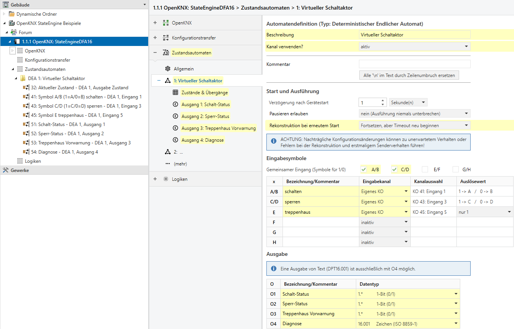
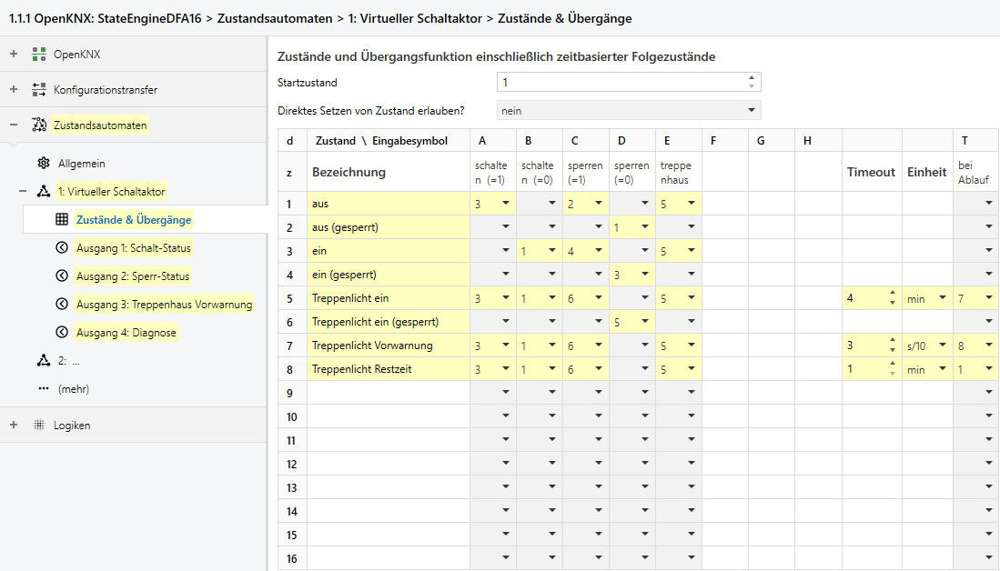
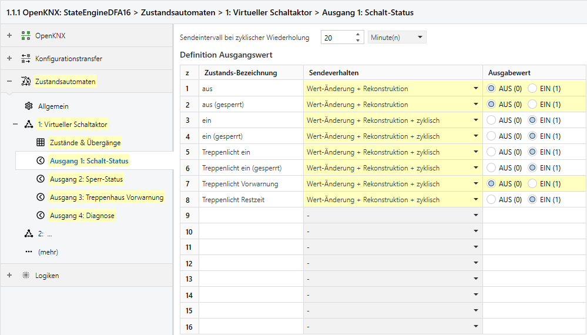
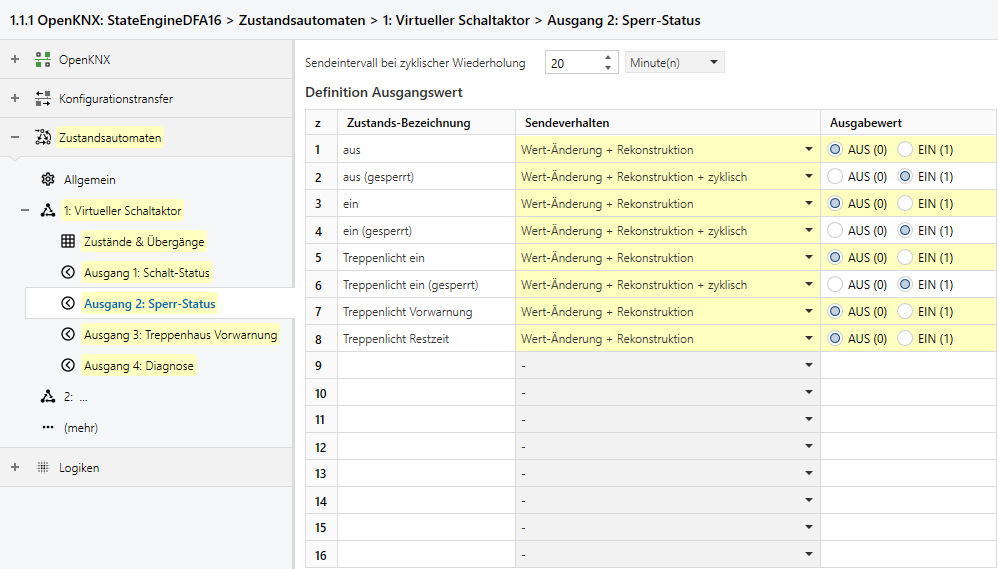
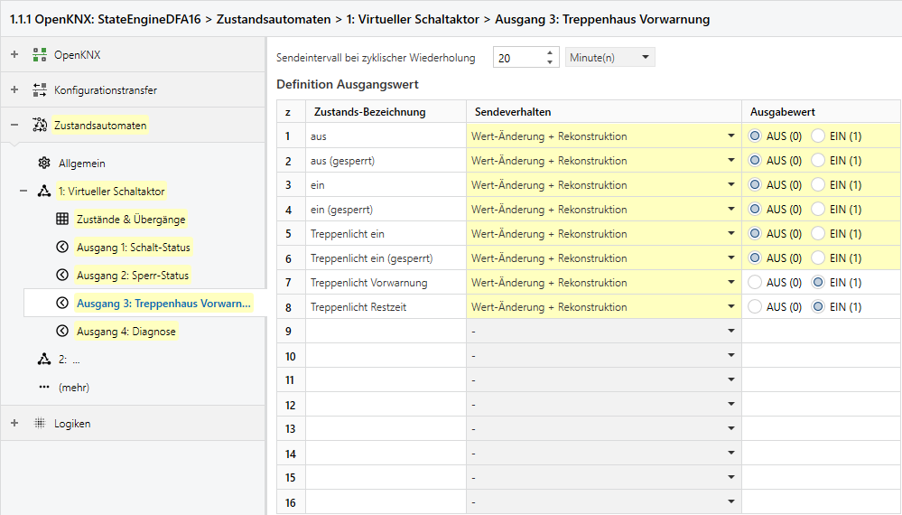
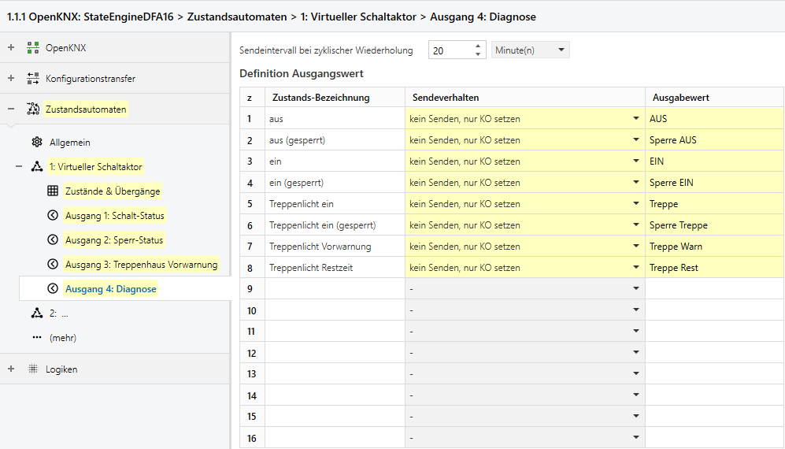

# Einführungsbeispiel für KNX-Nutzer: Virtueller Schaltaktor mit Sperre und Treppenhaus-Funktion

Dieses Beispiel soll die Nutzung der Zustandsautomaten greifbar machen,
insbesondere für Nutzer ohne theoretische Vorkenntnisse aus der Informatik.
Praktischerweise existiert ein zustandsabhängiges Verhalten, das Anwendern die mit KNX und der ETS arbeiten,
bereits bekannt ist:

Die Steuerung eines Schaltaktors mit üblichen Zusatzfunktionen.

Je nach Modell und Einstellung gibt es natürlich ein unterschiedliches Verhalten,
das dann ggf. durch Anpassung der Automatendefinition nachgebildet werden kann.

> **Praxisnutzen:**
> Die nachfolgend gezeigten Automaten können zur **Funktionserweiterung von Schaltaktor-Kanälen** eingesetzt werden,
> denen es an einer Treppenhaus- oder Sperr-Funktion mangelt.


# Inhalte

* [Eingabe](#eingabe)
* [Ausgabe](#ausgabe)
* [Grundkonfiguration Eingabesymbole und Ausgänge](#grundkonfiguration-eingabesymbole-und-ausgänge)
* [Zustände und Übergänge](#zustände-und-übergänge)
* [Ausgangswerte](#ausgangswerte)
* [Export zur Nutzung mit Konfigurationstransfer](#konfigurationsexport)


## Eingabe

Ein Schaltaktor-Kanal mit Sperre und Treppenhausfunktion verfügt über drei typische Eingangs KOs (die bei realen Aktoren u.U. nicht immer alle gleichzeitig sichtbar sind):

* Schalten – führt bei beim Eingang von 1 zum Einschalten und 0 zum Ausschalten, solange keine Sperre gesetzt ist
* Sperren – setzt oder entfernt die Sperre
* Auslöser für Treppenhaus-Funktion – führt zum Einschalten mit Automatischer Abschaltung am Ende der Nachlaufzeit, ggf. mit Vorwarnung durch kurzes Ausschalten bei Erreichen der Vorwarnzeit

Diese können durch 3 Eingänge abgebildet werden, die insgesamt 5 Eingabesymbole erzeugen:

* Kombiniertes Eingabe-KO „schalten“ zur Erzeugung der Eingabesymbole A/B (bei 1/0)
* Kombiniertes Eingabe-KO „sperren“ zur Erzeugung der Eingabesymbole C/D (bei 1/0)
* Einzelnes Eingabe-KO „treppenhaus“ zur Erzeugung des Eingabesymbols E (bei 1; der Wert 0 wird hier ignoriert)


## Ausgabe

Weiterhin verfügt ein entsprechender Schaltaktor-Kanal z.B. über Status-Ausgangs-KOs:

* Schalt-Status (zeigt an, ob der Kanal gerade eingeschaltet ist)
* Sperr-Status (zeigt an, ob der Kanal gerade gegen Steuerung gesperrt ist)
* Treppenhaus-Vorwarn-Signal für das Ende der Nachlaufzeit (zeigt an, ob ein automatisches Ausschalten bevorsteht)


Diese können durch die Ausgänge wie folgt abgebildet werden, hier im Beispiel noch ergänzt um die Ausgabe eines Diagnose-Textes:

* O1 „Schalt-Status“ mit Typ DPT1
* O2 „Sperr-Status“ mit Typ DPT1
* O3 „Treppenhaus Vorwarnung“ mit Typ DPT1
* O4 „Diagnose“ mit DPT16.001


## Grundkonfiguration Eingabesymbole und Ausgänge




## Zustände und Übergänge

Im Betrieb kann der Aktor-Kanal nun folgende Zustände annehmen (durch die auch die Ausgangswerte festgelegt werden):

* aus
* aus (gesperrt)
* ein
* ein (gesperrt)
* Treppenlicht ein
* Treppenlicht ein (gesperrt)
* Treppenlicht Vorwarnung
* Treppenlicht Restzeit


Beim ersten Start würde der Aus-Zustand angenommen, es kann jedoch auch ein anderer Zustand gewählt werden.
Bei aktivierter Rekonstruktion wird im zuvor gespeicherten Zustand fortgesetzt.
(Anmerkung: Das Verhalten nach Neustart innerhalb der Nachlaufzeit würd in diesem Fall von realen Aktoren abweichen.)
Bei externer Ansteuerung durch einen der Eingänge oder Zeit-Ablauf wechselt der Aktor-Kanal in einen definierten Nachfolgezustand, 
oder kann den Versuch der Ansteuerung auch ignorieren:

* aus
  * A -> 3 (einschalten)
  * C -> 2 (sperren)
  * E -> 5 (Treppenhaus einschalten)
* aus (gesperrt)
  * D -> 1 (entsperren)
* ein
  * B -> 1 (ausschalten)
  * C -> 4 (sperren)
  * E -> 5 (Treppenhaus einschalten)
* ein (gesperrt)
  * D -> 3 (entsperren)
* Treppenlicht ein
  * A -> 3 (einschalten)
  * B -> 1 (ausschalten)
  * C -> 6 (sperren)
  * E -> 5 (nachtriggern mit Neustart der Nachlaufzeit)
  * T (nach 4 Minuten) -> 7 (Beginn der Vorwarnzeit)
* Treppenlicht ein (gesperrt)
  * D -> 5 (entsperren mit Neustart der Nachlaufzeit)
* Treppenlicht Vorwarnung
  * A -> 3 (einschalten)
  * B -> 1 (ausschalten)
  * C -> 6 (sperren)
  * E -> 5 (nachtriggern mit Neustart der Nachlaufzeit)
  * T (nach 0,3s) -> 8 (kurzes Abschalten zur Warnung)
* Treppenlicht Restzeit
  * A -> 3 (einschalten)
  * B -> 1 (ausschalten)
  * C -> 6 (sperren)
  * E -> 5 (nachtriggern mit Neustart der Nachlaufzeit)
  * T (nach 60s) -> 1 (ausschalten)




## Ausgangswerte

Die Werte der verschiedenen Ausgänge sind direkt vom Zustand abhängig.
Hier im Beispiel wird durch die [Einstellung des Sendeverhaltens](DFA_Applikationsbeschreibung.md#sendeverhalten-je-zustand) erreicht,
dass EIN-Werte für Schalt- und Sperrstatus regelmäßig wiederholt werden.
Der Wert des hier für Diagnose-Zwecke verwendeten Ausgangs O4 wird nicht auf den Bus gesendet, 
kann aber durch das Update des Wertes per Read-Request abgefragt werden.







## Konfigurationsexport

DFA-Kanal 1
```
OpenKNX,cv1,0xAC0D:0x1/DFA:0x4/1§a~Name=Virtueller%20Schaltaktor§a~Active=1§a~StateRestore=1§a~SymbolPairAB=1§a~SymbolPairCD=1§a~SymbolAName:2=schalten§a~SymbolAInput:2=1§a~SymbolCName:2=sperren§a~SymbolCInput:2=1§a~SymbolEName:1=treppenhaus§a~SymbolEInput:1=1§a~Output1Name=Schalt-Status§a~Output2Name=Sperr-Status§a~Output3Name=Treppenhaus%20Vorwarnung§a~Output4Name=Diagnose§a~Output1Dpt=10§a~Output2Dpt=10§a~Output3Dpt=10§a~Output4Dpt=161§a~z01Name=aus§a~z02Name=aus%20(gesperrt)§a~z03Name=ein§a~z04Name=ein%20(gesperrt)§a~z05Name=Treppenlicht%20ein§a~z06Name=Treppenlicht%20ein%20(gesperrt)§a~z07Name=Treppenlicht%20Vorwarnung§a~z08Name=Treppenlicht%20Restzeit§a~d01A=3§a~d01C=2§a~d01E=5§a~z01o1Send=2§a~z01o1Dpt1=0§a~z01o2Send=2§a~z01o2Dpt1=0§a~z01o3Send=2§a~z01o3Dpt1=0§a~z01o4Send=1§a~z01o4Dpt16=AUS§a~d02D=1§a~z02o1Send=2§a~z02o1Dpt1=0§a~z02o2Send=3§a~z02o3Send=2§a~z02o3Dpt1=0§a~z02o4Send=1§a~z02o4Dpt16=Sperre%20AUS§a~d03B=1§a~d03C=4§a~d03E=5§a~z03o1Send=3§a~z03o2Send=2§a~z03o2Dpt1=0§a~z03o3Send=2§a~z03o3Dpt1=0§a~z03o4Send=1§a~z03o4Dpt16=EIN§a~d04D=3§a~z04o1Send=3§a~z04o2Send=3§a~z04o3Send=2§a~z04o3Dpt1=0§a~z04o4Send=1§a~z04o4Dpt16=Sperre%20EIN§a~d05A=3§a~d05B=1§a~d05C=6§a~d05E=5§a~d05T=7§a~d05TBase=1§a~d05TTime=4§a~z05o1Send=3§a~z05o2Send=2§a~z05o2Dpt1=0§a~z05o3Send=2§a~z05o3Dpt1=0§a~z05o4Send=1§a~z05o4Dpt16=Treppe§a~d06D=5§a~z06o1Send=3§a~z06o2Send=3§a~z06o3Send=2§a~z06o3Dpt1=0§a~z06o4Send=1§a~z06o4Dpt16=Sperre%20Treppe§a~d07A=3§a~d07B=1§a~d07C=6§a~d07E=5§a~d07T=8§a~d07TBase=3§a~d07TTime=3§a~z07o1Send=3§a~z07o1Dpt1=0§a~z07o2Send=2§a~z07o2Dpt1=0§a~z07o3Send=2§a~z07o4Send=1§a~z07o4Dpt16=Treppe%20Warn§a~d08A=3§a~d08B=1§a~d08C=6§a~d08E=5§a~d08T=1§a~d08TBase=1§a~d08TTime=1§a~z08o1Send=3§a~z08o2Send=2§a~z08o2Dpt1=0§a~z08o3Send=2§a~z08o4Send=1§a~z08o4Dpt16=Treppe%20Rest§;OpenKNX
```

