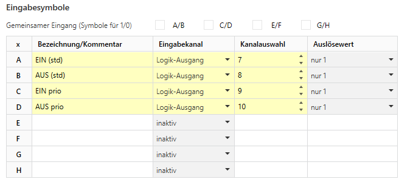

# Beispiel zur Vorverarbeitung durch Logik-Kanäle: Umwandlung von DPT2 (Zwangsführung) in Eingabesymbole

> **Praxisnutzen:**
> Die nachfolgend gezeigten Automaten können zur **Nachrüstung einer Zwangsführungssteuerung** eingesetzt werden,
> z.B. Zwangsführung mit Aktor-Kanälen ohne Zwangsführungsfunktion.

> **Gezeigte Konfigurationsmöglichkeiten:**
> Vorverarbeitung in Logik-Kanälen, nur Nutzung von externen Werten mit einem anderen Typ als DPT1.


Zwangsführungstelegramme (DPT2) können 4 Werte annehmen,
die nicht direkt zur Erzeugung eines Eingabesymbols verwendet werden können.
Dies lässt sich jedoch einfach durch eine Vorverarbeitung mittels Logik-Kanal lösen.
Eingabesymbole können entweder individuell oder paarweise erzeugt werden.
Nachfolgend werden beide Varianten gezeigt.

## Inhalte
* [Einfache Umsetzung mit 4 Logik-Kanälen](#einfache-umsetzung-mit-4-logik-kanälen)
* [Umsetzung mit 2 Logik-Kanälen und Eingangs-Paaren](#umsetzung-mit-2-logik-kanälen-und-eingangs-paaren)
* [Zustände und Übergänge](#zustände-und-übergänge)
* [Export zur Nutzung mit Konfigurationstransfer](#konfigurationsexport)


## Einfache Umsetzung mit 4 Logik-Kanälen

Im einfachsten Fall wird für jeden (benötigten) der 4 möglichen Werte ein eigener Logik-Kanal genutzt,
der auf seinem Ausgang die Erkennung signalisiert.
Dieser kann direkt in der Symbol-Definition ausgewählt werden
(ohne Umweg über eine Gruppenadresse oder die Notwendigkeit die interne KO-Nummer anzugeben):



Die Logik-Kanäle (Operation „UND“) mit einem einzelnen Eingang des Typen DPT2
und jeweils einem der 4 Werte zur Definition des Eingangs als EIN (und damit die anderen drei als AUS).
Die Ausgabe kann unverändert erfolgen; die AUS-Werte können unterdrückt werden,
sofern diese nicht auf eine optional zu Diagnosezwecken verbundene GA gesendet werden sollen.

> *Tipp:*
> Nur im ersten Logikkanal ein Eingabe-KO bereitstellen, in allen anderen das KO wiederverwenden durch relative KO-Verknüpfung.
So sieht das Ganze aus:


Ein „Nachteil“ dieser offensichtlichen Lösung ist die Belegung von 4 Logikkanälen,
während in der StateEngine im Mittel nur 3 Logikkanäle für jeden der Automaten zur Verfügung stehen.
Das gleiche Ergebnis kann jedoch auch mit nur 2 Logik-Kanälen erreicht werden:


## Umsetzung mit 2 Logik-Kanälen und Eingangs-Paaren

Die Eingabesymbole können in zwei Paare unterteilt werden: Normales Schalten und Schalten mit Priorität.
Diese Unterteilung ist nicht unmittelbar technisch bedingt, sorgt jedoch für eine übersichtlichere Darstellung
(und lässt in diesem Anwendungsfall auch die Option offen mit geringen Anpassungen einen DPT1-Wert zusätzlich für zum Erzeugen der „normalen“ Schaltaktionen zu verwenden):


Je ein Logik-Kanal erzeugt dann nur für den Fall „Normal“ bzw. „Priorität“ eine Ausgabe entsprechend des im DPT2 enthaltenen Schaltbefehls.
Dazu werden die Logik-Kanäle (Operation „UND“) mit zwei Eingängen konfiguriert: Eingang1 mit Typ DPT2
und den jeweils passenden zwei normalen bzw. priorisierten Werten zur Definition des Eingangs als EIN.
Die anderen beiden Werte setzen den Eingang1 entsprechend auf AUS.
Zur Ausgabe soll nur das Bit verwendet werden, das die Schaltaktion repräsentiert.
Das kann durch eine Bit-weise-UND-Verknüpfung (Ausgangswert für EIN ermitteln als Wert einer Funktion A=E1&E2)
von Eingang1 mit der Konstante 0b01 (normal schalten) definiert in Eingang2 erreicht werden,
bevor eine Umwandlung in DPT1 erfolgt. Für AUS darf der Ausgang nicht senden.
Siehe dazu die Tabelle:

|                     | */E2 | L5/E1 | L5/A=E1&E2           | L6/E1 | L6/A=E1&E2           | Symbol |
|---------------------|------|-------|----------------------|-------|----------------------|--------|
| normal aus (0b00)   | 0b01 | EIN   | 0b00 (0b00&0b01) AUS | AUS   | -                    | B      |
| normal ein (0b01)   | 0b01 | EIN   | 0b01 (0b01&0b01) EIN | AUS   | -                    | A      |
| prio aus (0b10)     | 0b01 | AUS   | -                    | EIN   | 0b00 (0b10&0b01) AUS | D      |
| prio ein (0b11)     | 0b01 | AUS   | -                    | EIN   | 0b01 (0b11&0b01) EIN | C      |


## Zustände und Übergänge

Vier Zustände entsprechend der Zwangsführungswerte werden definiert.
Beim Eingang eines Schaltbefehls mit Priorität erfolgt immer ein Wechsel auf den angegebenen Zustand.
Beim Eingang eines normalen Schaltbefehls erfolgt ein Zustandswechsel nur dann,
wenn aktuell ein normaler Zustand aktiv ist, oder aktuell derselbe Schaltzustand nur mit Priorität besteht,
d.h. allein die Priorität deaktiviert wird.


Optional kann ein automatischer Rückfall auf die Normal-Zustände definiert werden, durch Nutzung der Timeout-Funktion.
In diesem Fall i.d.R. um einen erneuten Aufruf des bestehenden Zustands, falls ein entsprechendes Schaltsignal eingeht.


## Konfigurationsexport

### Variante mit 4 Logik-Kanälen

DFA-Kanal 4 + Logik-Kanäle 7 bis 10
```
OpenKNX,cv1,0xAC0D:0x1/DFA:0x4/4§a~Name=Schalten%20mit%20Zwangsf%C3%BChrung%20(4%20Logiken)§a~Active=1§a~SymbolAName:1=EIN%20(std)§a~SymbolAInput:1=3§a~SymbolALogicNumber:1=7§a~SymbolBName=AUS%20(std)§a~SymbolBInput=3§a~SymbolBLogicNumber=8§a~SymbolCName:1=EIN%20prio§a~SymbolCInput:1=3§a~SymbolCLogicNumber:1=9§a~SymbolDName=AUS%20prio§a~SymbolDInput=3§a~SymbolDLogicNumber=10§a~Output1Name=schalten§a~Output2Name=sperren§a~Output4Name=Diagnose§a~Output1Dpt=10§a~Output2Dpt=10§a~Output4Dpt=161§a~z01Name=aus§a~z02Name=ein§a~z03Name=aus%20(priorisiert)§a~z04Name=ein%20(priorisiert)§a~d01A=2§a~d01C=4§a~d01D=3§a~z01o1Send=2§a~z01o1Dpt1=0§a~z01o2Send=2§a~z01o2Dpt1=0§a~z01o4Send=2§a~z01o4Dpt16=aus§a~d02B=1§a~d02C=4§a~d02D=3§a~z02o1Send=2§a~z02o2Send=2§a~z02o2Dpt1=0§a~z02o4Send=2§a~z02o4Dpt16=ein§a~d03B=1§a~d03C=4§a~z03o1Send=2§a~z03o1Dpt1=0§a~z03o2Send=2§a~z03o4Send=2§a~z03o4Dpt16=aus%20PRIO§a~d04A=2§a~d04D=3§a~z04o1Send=2§a~z04o2Send=2§a~z04o4Send=2§a~z04o4Dpt16=ein%20PRIO§;OpenKNX
OpenKNX,cv1,0xAC0D:0x1/LOG:0x35/7§f~Name=DPT2%20%3D%3D%20ein%20std%20(DFA%20Beispiel)§f~Logic=1§f~NameInput1=Zwangsf%C3%BChrung§f~E1=1§f~E1Dpt=1§f~NameOutput=DFA%20Zwang%20A%20(ein%20std)§;OpenKNX
OpenKNX,cv1,0xAC0D:0x1/LOG:0x35/8§f~Name=DPT2%20%3D%3D%20aus%20std%20(DFA%20Beispiel)§f~Logic=1§f~NameInput1=Zwangsf%C3%BChrung§f~E1=1§f~E1Dpt=1§f~E1OtherKORel=-3§f~E1UseOtherKO=2§f~E1Low0Dpt2=0§f~NameOutput=DFA%20Zwang%20B%20(aus%20std)§;OpenKNX
OpenKNX,cv1,0xAC0D:0x1/LOG:0x35/9§f~Name=DPT2%20%3D%3D%20ein%20prio%20(DFA%20Beispiel)§f~Logic=1§f~NameInput1=Zwangsf%C3%BChrung§f~E1=1§f~E1Dpt=1§f~E1OtherKORel=-6§f~E1UseOtherKO=2§f~E1Low0Dpt2=3§f~NameOutput=DFA%20Zwang%20C%20(ein%20prio)§;OpenKNX
OpenKNX,cv1,0xAC0D:0x1/LOG:0x35/10§f~Name=DPT2%20%3D%3D%20aus%20prio%20(DFA%20Beispiel)§f~Logic=1§f~NameInput1=Zwangsf%C3%BChrung§f~E1=1§f~E1Dpt=1§f~E1OtherKORel=-9§f~E1UseOtherKO=2§f~E1Low0Dpt2=2§f~NameOutput=DFA%20Zwang%20D%20(aus%20prio)§;OpenKNX
```

### Variante mit 2 Logik-Kanälen

DFA-Kanal 3 + Logik-Kanäle 5 und 6
```
OpenKNX,cv1,0xAC0D:0x1/DFA:0x4/3§a~Name=Schalten%20mit%20Zwangsf%C3%BChrung%20(2%20Logiken)§a~Active=1§a~SymbolPairAB=1§a~SymbolPairCD=1§a~SymbolAName:2=normal§a~SymbolAInput:2=3§a~SymbolALogicNumber:2=5§a~SymbolCName:2=prio§a~SymbolCInput:2=3§a~SymbolCLogicNumber:2=6§a~Output1Name=schalten§a~Output2Name=sperren§a~Output4Name=Diagnose§a~Output1Dpt=10§a~Output2Dpt=10§a~Output4Dpt=161§a~z01Name=aus§a~z02Name=ein§a~z03Name=aus%20(priorisiert)§a~z04Name=ein%20(priorisiert)§a~d01A=2§a~d01C=4§a~d01D=3§a~z01o1Send=2§a~z01o1Dpt1=0§a~z01o2Send=2§a~z01o2Dpt1=0§a~z01o4Send=2§a~z01o4Dpt16=aus§a~d02B=1§a~d02C=4§a~d02D=3§a~z02o1Send=2§a~z02o2Send=2§a~z02o2Dpt1=0§a~z02o4Send=2§a~z02o4Dpt16=ein§a~d03B=1§a~d03C=4§a~z03o1Send=2§a~z03o1Dpt1=0§a~z03o2Send=2§a~z03o4Send=2§a~z03o4Dpt16=aus%20PRIO§a~d04A=2§a~d04D=3§a~z04o1Send=2§a~z04o2Send=2§a~z04o4Send=2§a~z04o4Dpt16=ein%20PRIO§;OpenKNX
OpenKNX,cv1,0xAC0D:0x1/LOG:0x35/5§f~Name=DPT2%20%7C%20nur%20ohne%20prio%20§f~Logic=1§f~NameInput1=Zwangsf%C3%BChrung§f~E1=1§f~E1Dpt=1§f~E1Low0Dpt2=0§f~E1Low1Dpt2=1§f~NameInput2=Bit-Maske%20f%C3%BCr%20Schalt-Wert%20(0b01)§f~E2ConvertSpecial=5§f~E2=1§f~E2Dpt=1§f~E2LowDpt2Fix=1§f~NameOutput=DFA%20Zwang%20A%2FB%20(ohne%20prio)§f~OOn=8§f~OOnAll=8§f~OOnFunction=9§f~OOff=0§f~OOffAll=0§;OpenKNX
OpenKNX,cv1,0xAC0D:0x1/LOG:0x35/6§f~Name=DPT2%20%7C%20nur%20mit%20prio%20§f~Logic=1§f~NameInput1=Zwangsf%C3%BChrung§f~E1=1§f~E1Dpt=1§f~E1OtherKORel=-3§f~E1UseOtherKO=2§f~E1Low0Dpt2=2§f~E1Low1Dpt2=3§f~NameInput2=Bit-Maske%20f%C3%BCr%20Schalt-Wert%20(0b01)§f~E2ConvertSpecial=5§f~E2=1§f~E2Dpt=1§f~E2LowDpt2Fix=1§f~NameOutput=DFA%20Zwang%20C%2FD%20(prio)§f~OOn=8§f~OOnAll=8§f~OOnFunction=9§f~OOff=0§f~OOffAll=0§;OpenKNX
```
